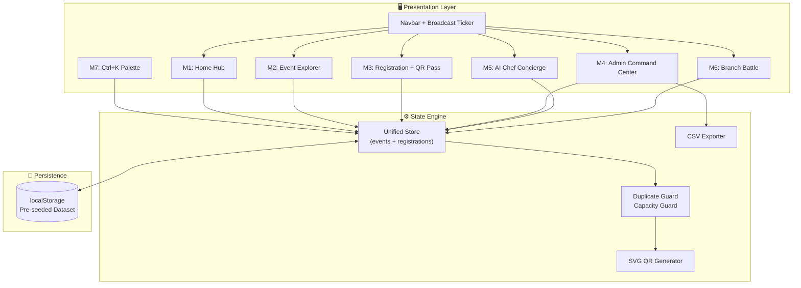

# 👨‍🍳🔥 CodeChef ABESEC — The Code Kitchen
## `ChefOps v2.6` — Event Lifecycle & Ground Operations Platform

> **Next-generation college club event management, registration, and on-ground operations command center.**  
> Built for CodeChef ABESEC Chapter Recruitments 2026–27.  
> Stations: `💻 Development` (1st Preference) + `🎪 Events & Operations` (2nd Preference)

---

## 🎯 What Makes This Different

The recruitment task asks for a "responsive web application for managing and displaying college club events." Here's how ChefOps v2.6 compares against a standard submission:

| Task Requirement | Standard Submission | 🔥 ChefOps v2.6 |
|:---|:---|:---|
| **Home Page** (Club intro, upcoming/featured events) | Static text + 3 cards | Interactive terminal hero, live ticking countdown (`DD:HH:MM:SS`), flagship spotlight with seat occupancy meter, live broadcast ticker |
| **Events Page** (List, cards, search, filter) | Basic search + category dropdown | Multi-filter search engine, smart sort (date / filling-fast / capacity), layout toggle (grid/compact), color-coded capacity heatmap bars |
| **Event Detail** | Static description paragraph | Full Run-of-Show modal: hour-by-hour timeline, station owners, mentors with badges, prerequisites, prize pool |
| **Registration** (Name, email, year, phone) | Form → `alert("Done!")` | Validated form with duplicate guard, capacity check, instant holographic QR "Chef Pass" (`#CC-ABES-XXXX`) with confetti + print/PDF |
| **Admin Dashboard** (Add, edit, delete, view students) | Basic CRUD table | 1-click evaluator login, full CRUD with live propagation, QR gate check-in scanner simulator, multi-filter student roster, 1-click CSV attendance export, live broadcast editor |
| **Beyond Requirements** | *Nothing* | `Ctrl+K` command palette, AI event recommender ("Head Chef"), live branch participation battle leaderboard |

---

## 📚 Engineering & Operations Documentation

Every architectural decision, module specification, operational procedure, and design token is documented in the [`/docs`](./docs/) directory:

| Document | What It Covers |
|:---|:---|
| [🏗️ 01 — System Architecture](./docs/01-SYSTEM-ARCHITECTURE.md) | ADRs, system diagram, state management, responsive breakpoints, performance budgets, security model |
| [🧩 02 — Module Breakdown](./docs/02-MODULE-BREAKDOWN.md) | Deep specification of all 7 feature modules with interaction flows, state contracts, wireframes, and algorithms |
| [🎪 03 — Event Ops Runbook](./docs/03-EVENT-OPS-RUNBOOK.md) | Ground SOPs: pre-event capacity monitoring, gate QR check-in flow, run-of-show management, post-event CSV export for faculty |
| [🎨 04 — UI/UX Design System](./docs/04-UI-UX-DESIGN-SYSTEM.md) | Color tokens, typography scale, glassmorphism specs, motion system, WCAG accessibility audit, responsive layouts |

---

## 🧪 60-Second Evaluator Walkthrough

> **For CodeChef ABESEC recruitment reviewers:** Here's how to test every major feature in under a minute.

### Step 1 — Explore the Home Hub
Open the live deployment link. You'll see the **interactive terminal hero**, **live KPI counters**, and the **Cook-Off 7.0 flagship spotlight** with a **real-time countdown timer** and **seat occupancy meter**.

### Step 2 — Discover Events
Click **"Explore Events"**. Use the **search bar** (try "hackathon" or "Bhabha"), **category pills**, and **sort options**. Notice the **color-coded capacity bars** on each card. Click **"Run-of-Show & Details"** on any event to see the minute-by-minute agenda.

### Step 3 — Register & Get Your QR Chef Pass
Click **"Book Seat"** on any event. Fill the form and submit. Watch the **confetti burst** and your **holographic QR Chef Pass (`#CC-ABES-XXXX`)** generate instantly. Click **"Print / Save Pass"** or note the ticket ID.

### Step 4 — Enter the Admin Command Center
Click **"🛡️ Admin & Ops"** in the navigation. Click **"⚡ 1-Click Evaluator Login"** (or enter PIN `2026`). You now have full access to:
- **Add / Edit / Delete events** (changes reflect instantly on the student side)
- **QR Gate Scanner** — enter any ticket ID to simulate venue gate check-in
- **Student Roster** — search, filter by branch/event/status, and **export to CSV**
- **Broadcast Editor** — type a message and watch it appear in the top ticker bar

### Step 5 — Power Features
- Press **`Ctrl + K`** from anywhere to open the **Command Palette** (search events, jump to admin, export CSV)
- Try the **"🤖 Head Chef AI"** concierge to get a personalized event recommendation
- Check the **"🏆 Branch Battle"** leaderboard to see live branch participation rankings

---

## 🛠️ Tech Stack

| Layer | Technology | Version |
|:---|:---|:---|
| **Framework** | React | 19.x |
| **Build Tool** | Vite | 6.x |
| **Styling** | Tailwind CSS | v4 (CSS-first, `@tailwindcss/vite` plugin) |
| **Typography** | Space Grotesk · Inter · JetBrains Mono | Google Fonts CDN |
| **Icons** | lucide-react | Latest (tree-shakeable) |
| **Celebrations** | canvas-confetti | ^1.9 |
| **QR Generation** | Custom deterministic SVG (FNV-1a hash → 11×11 matrix) | Hand-rolled, zero deps |
| **State** | React `useState` + `useEffect` → `localStorage` sync | Built-in |
| **Deployment** | Vercel / Netlify / GitHub Pages | Any static host |

---

## 💻 Local Development Setup

### Prerequisites
- Node.js ≥ 18.x
- npm ≥ 9.x

### Installation

```bash
# Clone the repository
git clone https://github.com/<your-username>/codechef-abesec-events.git
cd codechef-abesec-events

# Install dependencies
npm install

# Start development server (hot-reload enabled)
npm run dev
```

The dev server starts at `http://localhost:5173`.

### Production Build

```bash
# Generate optimized production bundle
npm run build

# Preview the production build locally
npm run preview
```

### Deployment (Vercel — Recommended)

```bash
# Option 1: Vercel CLI
npx vercel

# Option 2: Connect GitHub repo to vercel.com
# Framework Preset: Vite
# Build Command: npm run build
# Output Directory: dist
```

---

## 📁 Project Structure

```
codechef-abesec-events/
│
├── docs/                                    # 📚 Engineering & Operations Documentation
│   ├── 01-SYSTEM-ARCHITECTURE.md            # System design, ADRs, state architecture
│   ├── 02-MODULE-BREAKDOWN.md               # All 7 modules: specs, contracts, algorithms
│   ├── 03-EVENT-OPS-RUNBOOK.md              # Ground ops SOPs, gate check-in, CSV export
│   └── 04-UI-UX-DESIGN-SYSTEM.md            # Design tokens, typography, motion, a11y
│
├── src/
│   ├── data/
│   │   └── initialData.js                   # Pre-seeded ABESEC events & registrations
│   ├── modules/
│   │   ├── home/HomeModule.jsx              # M1: Hero, countdown, flagship spotlight
│   │   ├── events/EventsExplorerModule.jsx  # M2: Search, filter, sort, run-of-show
│   │   ├── registration/
│   │   │   ├── RegistrationModal.jsx        # M3A: Validated registration form
│   │   │   └── QrPassModal.jsx              # M3B: Holographic QR Chef Pass
│   │   ├── admin/AdminOpsModule.jsx         # M4: CRUD, scanner, CSV, broadcast
│   │   ├── concierge/AiChefFinderModule.jsx # M5: AI event recommender
│   │   ├── leaderboard/BranchBattleModule.jsx # M6: Branch participation battle
│   │   └── command/CommandPalette.jsx       # M7: Ctrl+K command palette
│   ├── App.jsx                              # Root orchestrator & unified state owner
│   ├── main.jsx                             # Application entry point
│   └── index.css                            # Tailwind v4 + holographic custom styles
│
├── index.html                               # HTML shell with font preconnects
├── vite.config.js                           # Vite + React + Tailwind v4 plugin
├── package.json                             # Dependencies & scripts
└── README.md                                # ← You are here
```

---

## 🏗️ Module Architecture Overview



---

## 📄 License

This project was built as a recruitment submission for **CodeChef ABESEC Chapter (2026–27)**. Feel free to reference or fork for educational purposes.

---

<p align="center">
  Crafted with ☕, Chai & Commits for <b>CodeChef ABESEC Chapter 2026–27</b><br/>
  <code>ChefOps v2.6</code> · <code>💻 Development</code> + <code>🎪 Events & Operations</code>
</p>
