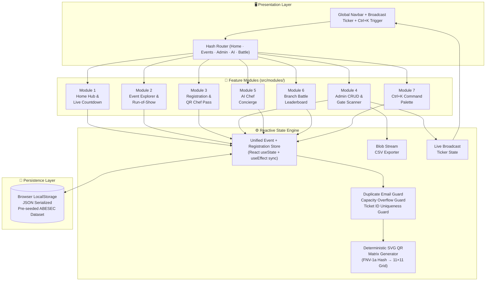

# 🏗️ System Architecture & Engineering Blueprint
### `ChefOps v2.6` — CodeChef ABESEC Event Lifecycle & Ground Operations Platform

| Meta | Detail |
|:---|:---|
| **RFC Status** | `APPROVED` — Ready for Implementation |
| **Author** | Rohit Sharma (`💻 Dev` + `🎪 Events & Ops`) |
| **Target Chapter** | CodeChef ABESEC 2026–27 |
| **Last Revised** | 28 September 2026 |
| **Stack** | React 19 · Vite 6 · Tailwind CSS v4 · LocalStorage Persistence Engine |

---

## 1. Problem Statement & Motivation

> **"95% of college club event portals are glorified Google Forms wrapped in Bootstrap cards."**

The CodeChef ABESEC recruitment task asks for a "responsive web application for managing and displaying college club events." Most submissions will deliver:
- A static card grid with hardcoded event data
- A `<form>` that shows `alert("Registered!")` on submit
- An admin page with a basic HTML `<table>`

**ChefOps v2.6** redefines the ceiling by treating this as a **production-grade Event Lifecycle Platform** that bridges two critical chapter stations:

| Station | Role in ChefOps |
|:---|:---|
| **💻 Development** | Reactive SPA architecture, deterministic QR encoding, keyboard-first UX, zero-reload state propagation |
| **🎪 Events & Operations** | Gate check-in verification, capacity overflow alerting, run-of-show execution timelines, CSV attendance exports for faculty OD sheets |

---

## 2. Architectural Decision Records (ADRs)

### ADR-001: Client-Side SPA vs Full-Stack with Backend API

| | Client-Only SPA | Full-Stack (Express/Supabase) |
|:---|:---|:---|
| **Setup Complexity** | Zero — `npm run dev` | Requires DB provisioning, auth, CORS |
| **Evaluation Friction** | Reviewer opens Vercel link → instantly usable | Reviewer needs to create account, wait for cold start |
| **Offline Resilience** | Full functionality via LocalStorage | Breaks without network |
| **Demonstrates Skill** | State management, reactivity, UX engineering | API design, auth flows |

**Decision:** Client-Only SPA with LocalStorage persistence engine.  
**Rationale:** Recruitment reviewers evaluate in **< 60 seconds**. Zero-friction instant usability > architectural complexity they can't test.

---

### ADR-002: Why Deterministic SVG QR Matrix Instead of a Library

| Approach | Bundle Cost | Customizability | Visual Control |
|:---|:---|:---|:---|
| `qrcode.react` | +18 KB gzip | Limited (raster canvas) | Low |
| Custom SVG Generator | 0 KB (inline) | Full (corner finders, colors, rounded rects) | Pixel-perfect |

**Decision:** Hand-rolled 11×11 deterministic SVG matrix with FNV-1a hash seeding.  
**Rationale:** Zero dependency cost. Full control over holographic ticket aesthetics. Corner finder patterns match real QR spec.

---

### ADR-003: Tailwind CSS v4 with `@tailwindcss/vite` Plugin

**Decision:** Tailwind v4 (CSS-first config) via the official Vite plugin.  
**Rationale:** No `tailwind.config.js` file needed. PostCSS pipeline eliminated. Lightning-fast HMR. `@import "tailwindcss"` in CSS is the entire setup.

---

## 3. System Architecture Diagram



---

## 4. State Management Architecture

### 4.1 Unified Store Contract

All state lives in `App.jsx` and flows downward via props. No external state library is needed because the state graph has a **single owner** (App) with **unidirectional data flow** to leaf modules.

```
┌─────────────────────────────────────────────────────┐
│                    App.jsx (Owner)                   │
│                                                     │
│  events: Event[]          ← CRUD by Admin Module    │
│  registrations: Reg[]     ← Created by Reg Module   │
│  broadcastMsg: string     ← Set by Admin Module     │
│  activeView: ViewEnum     ← Set by Nav/CmdPalette   │
│  cmdPaletteOpen: boolean  ← Toggled by Ctrl+K       │
│  adminAuth: boolean       ← 1-Click Demo Login      │
│                                                     │
│  ┌─────────────┐  ┌──────────────┐  ┌────────────┐ │
│  │ HomeModule  │  │ EventsModule │  │ AdminModule│ │
│  │ (read-only) │  │ (read-only)  │  │ (read/write│ │
│  └─────────────┘  └──────────────┘  └────────────┘ │
└─────────────────────────────────────────────────────┘
```

### 4.2 LocalStorage Sync Protocol

```
Page Load → Check localStorage("chefops-events")
  ├─ EXISTS  → JSON.parse() → Hydrate state
  └─ MISSING → Seed from initialData.js → Write to LS

On every state mutation → JSON.stringify() → Write to LS
  └─ Debounce: Synchronous (each setState triggers useEffect)

Reset Demo → Clear LS keys → Re-seed from initialData.js
```

---

## 5. Responsive Breakpoint Architecture

| Breakpoint | Tailwind | Target Devices | Layout Behavior |
|:---|:---|:---|:---|
| **Mobile S** | `< 480px` | iPhone SE, budget Android | Single column. Stacked cards. Bottom-sheet modals. Hamburger nav. |
| **Mobile L** | `sm: 640px` | iPhone 14/15, Pixel | 1-column cards with wider padding. Side-by-side form fields. |
| **Tablet** | `md: 768px` | iPad Mini, Galaxy Tab | 2-column event grid. Sidebar admin nav visible. |
| **Desktop** | `lg: 1024px` | Laptops, recruitment reviewer screens | 3-column event grid. Full admin dashboard. Command palette centered. |
| **Wide** | `xl: 1280px` | External monitors, presentations | Max-width container `1280px` centered. Comfortable whitespace. |

---

## 6. Performance Budget

| Metric | Target | Strategy |
|:---|:---|:---|
| **First Contentful Paint** | < 1.2s | Vite code-splitting, zero external CSS frameworks, font `display=swap` |
| **Largest Contentful Paint** | < 2.0s | No hero images, SVG-only graphics, inline critical CSS via Tailwind |
| **Total Bundle (gzip)** | < 120 KB | Zero heavy deps (`lucide-react` tree-shakes, `canvas-confetti` is 6 KB) |
| **Lighthouse Score** | > 90 (Performance, A11y, Best Practices) | Semantic HTML, ARIA labels, color contrast ratios > 4.5:1 |

---

## 7. Security Model

| Threat | Mitigation |
|:---|:---|
| **XSS via event titles/descriptions** | React's default JSX escaping. No `dangerouslySetInnerHTML` anywhere. |
| **Admin bypass** | Admin is a demo-mode toggle (no real auth needed for recruitment task). PIN `2026` is cosmetic friction only. |
| **LocalStorage tampering** | Graceful fallback: if JSON parse fails, re-seed from `initialData.js`. No sensitive data stored. |
| **Duplicate registration spam** | Email + EventID compound uniqueness check before seat allocation. |

---

## 8. Directory Structure (Production-Ready)

```
codechef-abesec-events/
│
├── docs/                                    # 📚 Engineering & Operations Documentation
│   ├── 01-SYSTEM-ARCHITECTURE.md            # ← You are here
│   ├── 02-MODULE-BREAKDOWN.md               # Deep dive: all 7 feature modules
│   ├── 03-EVENT-OPS-RUNBOOK.md              # Ground operations SOPs & workflows
│   └── 04-UI-UX-DESIGN-SYSTEM.md            # Design tokens, typography, responsive specs
│
├── src/
│   ├── data/
│   │   └── initialData.js                   # Pre-seeded ABESEC events & registrations
│   ├── modules/
│   │   ├── home/HomeModule.jsx              # M1: Hero, countdown, flagship spotlight
│   │   ├── events/EventsExplorerModule.jsx  # M2: Search, filter, sort, run-of-show
│   │   ├── registration/
│   │   │   ├── RegistrationModal.jsx        # M3A: Validated ABESEC registration form
│   │   │   └── QrPassModal.jsx              # M3B: Holographic QR Chef Pass generator
│   │   ├── admin/AdminOpsModule.jsx         # M4: CRUD, scanner, CSV, broadcast
│   │   ├── concierge/AiChefFinderModule.jsx # M5: Interactive AI event recommender
│   │   ├── leaderboard/BranchBattleModule.jsx # M6: Live branch participation battle
│   │   └── command/CommandPalette.jsx       # M7: Ctrl+K power navigation
│   ├── App.jsx                              # Root orchestrator & state owner
│   ├── main.jsx                             # Entry point
│   └── index.css                            # Tailwind v4 + custom holographic styles
│
├── index.html                               # Shell with font preconnects & dark mode
├── vite.config.js                           # Vite + React + Tailwind v4 plugin
├── package.json                             # Dependencies & scripts
└── README.md                                # Flagship project overview & evaluator guide
```

---

<p align="center"><code>ChefOps v2.6</code> · Architecture Document · CodeChef ABESEC 2026–27</p>
