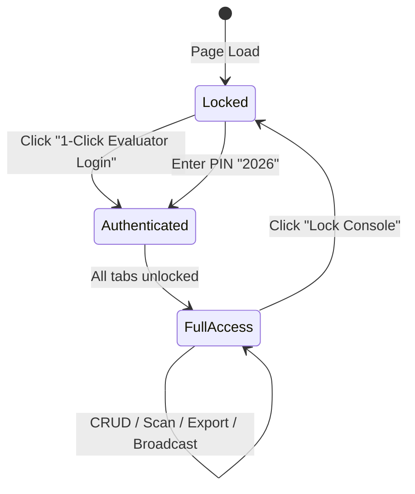
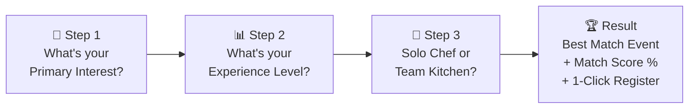

# 🧩 Comprehensive Module Breakdown — Modules 1 through 7
### `ChefOps v2.6` — Feature Module Specifications & Interaction Contracts

| Meta | Detail |
|:---|:---|
| **Total Modules** | 7 (each independently testable, zero circular dependencies) |
| **Rendering Strategy** | Conditional mount via `activeView` enum in `App.jsx` — unmounted modules consume zero CPU |
| **State Ownership** | All modules receive state via props from `App.jsx`. Mutations flow upward via callback props. |

---

## Module 1 — `HomeModule.jsx` — The Code Kitchen Landing Hub

### 1.1 Purpose
First 5 seconds determine whether a recruiter keeps scrolling or closes the tab. This module exists to **hook attention instantly** with interactive motion, live data, and CodeChef ABESEC identity.

### 1.2 Feature Specification

| Feature | Implementation Detail | UX Goal |
|:---|:---|:---|
| **Terminal Hero Badge** | Styled `<pre>` block: `$ chef init --chapter="ABESEC-2026"` with JetBrains Mono, amber glow border, blinking cursor animation | Signals "this person thinks like a developer" |
| **Live KPI Counter Strip** | 4 glassmorphism metric cards computed from `events[]` and `registrations[]`: *Total Events*, *Active Chefs Registered*, *Gate Verified Check-Ins*, *Chapter Stations* | Proves the app has real reactive data, not hardcoded |
| **Flagship Spotlight Card** | Dynamically renders the `featured: true` event. Contains: Title, Subtitle, Venue with `MapPin` icon, Seat Occupancy Bar (`registeredCount / capacity`), and **Live Countdown Timer** | Creates urgency ("Only 16 seats left!") |
| **Live Countdown Engine** | `setInterval(1000ms)` computing `days:hours:mins:secs` delta from `event.date`. Auto-clears on unmount via `useEffect` cleanup. | Real-time interactivity — impossible with static HTML |
| **Chapter Stations Grid** | 4 cards highlighting `Development`, `Events & Ops`, `CP`, and `Creative` with gradient borders and role descriptions | Tells the recruiter "I understand the org structure" |
| **Broadcast Ticker Integration** | Reads `broadcastMsg` from parent. Renders as a sliding amber bar at page top (set by Admin Module 4). | Simulates real event-day announcements |

### 1.3 State Dependencies

```
Props received from App.jsx:
  ├── events: Event[]              (read-only — to find featured event)
  ├── registrations: Registration[] (read-only — to compute KPI counters)
  ├── broadcastMsg: string          (read-only — top ticker content)
  ├── onNavigate: (view) => void    (to jump to Events/Register)
  └── onOpenRegister: (event) => void (to open registration modal)
```

### 1.4 Responsive Behavior

| Viewport | Layout |
|:---|:---|
| Mobile (`< 640px`) | KPI cards: 2×2 grid. Spotlight card: full-width stacked. Stations: single column scroll. |
| Tablet (`768px`) | KPI cards: 4-across. Spotlight: horizontal layout with countdown beside title. |
| Desktop (`1024px+`) | Full hero section. KPI strip. Spotlight card with generous padding. Stations: 4-column grid. |

---

## Module 2 — `EventsExplorerModule.jsx` — Smart Discovery & Run-of-Show

### 2.1 Purpose
Transform a basic "list of cards" into an **intelligent event discovery engine** with multi-dimensional filtering, dynamic capacity visualization, and hour-by-hour operational timelines.

### 2.2 Feature Specification

| Feature | Implementation Detail |
|:---|:---|
| **Instant Search** | `input[type=text]` filters `events[]` across `title`, `venue`, `description`, and `tags[]` using case-insensitive `includes()`. Debounce: immediate (small dataset). |
| **Category Filter Pills** | Horizontal scrollable pill bar: `All` · `Hackathon` · `Competitive Programming` · `Development` · `Workshop` · `Tech Talk`. Active pill highlighted amber. |
| **Smart Sort Dropdown** | 3 sort modes: `Upcoming Date` (chronological), `Filling Fast` (descending occupancy %), `Capacity` (descending total seats). |
| **Layout Toggle** | Switch between `Grid View` (rich cards with descriptions) and `Compact View` (dense table rows for power users/admins). |
| **Capacity Heatmap Bars** | Dynamic `<div>` width = `(registeredCount / capacity) * 100%`. Color semantics: `< 65%` → Emerald, `65–85%` → Amber, `> 85%` → Rose with pulsing animation. |
| **Event Card Anatomy** | Each card renders: Category badge, Title, Date/Time (Calendar + Clock icons), Venue (MapPin icon), 2-line description, Tags as micro-badges, Capacity bar, and 2 CTAs: `Run-of-Show & Details` + `Book Seat`. |

### 2.3 Run-of-Show Agenda Modal (Events & Ops Differentiator)

When `Run-of-Show & Details` is clicked, a full-screen modal opens with:

```
┌──────────────────────────────────────────────────────────┐
│  ◆ Cook-Off 7.0: The 24-Hour Flagship Hackathon         │
│  ─────────────────────────────────────────────────────── │
│                                                          │
│  📍 Venue    Aryabhatta Block Seminar Hall               │
│  🏆 Prize    ₹75,000 + Goodies & PPIs                   │
│  👥 Team     2-4 Members (or Solo)                       │
│  📋 Prereqs  Laptop, College ID, GitHub Account          │
│                                                          │
│  ── Hour-by-Hour Execution Timeline ──────────────────── │
│                                                          │
│  09:00 AM  │ Gate Check-In & QR Pass Verification        │
│            │ Owner: Events & Ops Desk                    │
│  10:30 AM  │ Problem Statements Unlocked 🔔              │
│            │ Owner: Core Dev & CP Leads                  │
│  04:00 PM  │ Mentorship Checkpoint + Chai Fuel Drop ☕    │
│            │ Owner: Mentors & Ops Team                   │
│  12:00 AM  │ Midnight Lightning Bug-Smash Contest        │
│            │ Owner: CP Station                           │
│  08:00 AM  │ Git Freeze, Jury Pitching & Coronation 🏆   │
│            │ Owner: All Stations                         │
│                                                          │
│  ── Mentors & Judges ────────────────────────────────── │
│  Aarav Verma (6★ CodeChef) · Sneha Nair (GSoC '26)      │
│                                                          │
│  [ Book Seat ]                              [ Close  ]   │
└──────────────────────────────────────────────────────────┘
```

### 2.4 State Dependencies

```
Props received:
  ├── events: Event[]
  ├── registrations: Registration[]  (to compute live occupancy)
  ├── onSelectEvent: (event) => void (opens Run-of-Show modal)
  └── onOpenRegister: (event) => void
```

---

## Module 3 — Registration & Holographic QR Chef Pass

### 3A: `RegistrationModal.jsx` — Smart Registration Form

### 3A.1 Form Field Specification

| Field | Type | Validation | UX Enhancement |
|:---|:---|:---|:---|
| **Full Name** | `text` | Required, min 2 chars | Auto-capitalize first letter |
| **College Email** | `email` | Required, `@abes.ac.in` encouraged | Inline helper text |
| **Year** | `select` | Required | Options: `1st Year (2026-30)` through `4th Year (2023-27)` |
| **Branch** | `select` | Required | `CSE`, `CSE-AIML`, `CSE-DS`, `IT`, `ECE`, `ME`, `Other` |
| **WhatsApp Number** | `tel` | Required, exactly 10 digits, starts with 6-9 | Numeric keyboard on mobile (`inputMode="numeric"`) |
| **GitHub/CodeChef Handle** | `url` | Optional | Placeholder: `github.com/your-handle` |

### 3A.2 Duplicate Registration Guard

```
On Submit:
  1. Check registrations.find(r => r.email === input.email && r.eventId === selectedEvent.id)
  2. If FOUND → Show warning: "You're already registered! Here's your existing pass."
     → Open QrPassModal with existing ticket
  3. If NOT FOUND → Check capacity: event.registeredCount < event.capacity
     a. If FULL → Show error: "This event is at full capacity."
     b. If AVAILABLE → Create registration, generate ticketId, increment count, fire confetti
```

### 3A.3 Ticket ID Generation Algorithm

```javascript
// Format: CC-ABES-XXXX (4-digit numeric suffix)
const ticketId = `CC-ABES-${String(Math.floor(1000 + Math.random() * 9000))}`;
// Collision check: while (registrations.some(r => r.ticketId === newId)) { regenerate }
```

---

### 3B: `QrPassModal.jsx` — Holographic QR Chef Pass

### 3B.1 Visual Anatomy

```
┌─ ─ ─ ─ ─ ─ ─ ─ ─ ─ ─ ─ ─ ─ ─ ─ ─ ─ ─ ─ ─ ─ ─ ─ ─┐
╎  ✦ CODECHEF ABESEC // OFFICIAL KITCHEN ENTRY PASS     ╎
╎                                                        ╎
╎  Cook-Off 7.0: The 24-Hour Flagship Hackathon          ╎
╎                                                        ╎
╎  ┌─────────┐   CONFIRMED SEAT // READY FOR SCAN       ╎
╎  │ ██ ██ █ │                    CC-ABES-9041 [📋]     ╎
╎  │ █ ██ ██ │                                           ╎
╎  │ ██ █ ██ │   Chef: Rohit Sharma                      ╎
╎  │ █ ██ █ █│   CSE • 2nd Year (2025-29)                ╎
╎  │ ██ ██ ██│   rohit.25b010@abes.ac.in                 ╎
╎  └─────────┘   +91 9876543210                          ╎
╎  CC-ABES-9041  Station: Development + Events           ╎
╎                                                        ╎
╎ ·····················[tear here]····················   ╎
╎                                                        ╎
╎  [ 🖨️ Print / Save PDF ]  [ 📷 Simulate Gate Scan ]   ╎
└─ ─ ─ ─ ─ ─ ─ ─ ─ ─ ─ ─ ─ ─ ─ ─ ─ ─ ─ ─ ─ ─ ─ ─ ─┘
```

### 3B.2 QR Matrix Generation (Zero Dependencies)

The SVG QR code is generated using a **deterministic FNV-1a hash** of `ticketId + email`:

```
Input: "CC-ABES-9041-rohit.25b010@abes.ac.in"
  ↓ FNV-1a 32-bit hash
Hash: 0xA7B3F19E
  ↓ Bit extraction per cell position
Grid: 11×11 cells (121 total)
  ├── Corners (3×3 at TL, TR, BL): Always filled (amber) — mimics real QR finder patterns
  └── Data cells: hash bit at position (r*11+c) mod 28 → filled (dark) or empty
  ↓ SVG render
<rect> elements with rounded corners, crisp edges, white background
```

### 3B.3 Holographic Animation (CSS)

The `holo-ticket` class applies a `conic-gradient` that rotates via `@keyframes spin-slow` (14s cycle), creating a light-refraction effect across the ticket surface. Perforated divider uses `border-dashed` with circular cutouts positioned via `absolute` negative offsets.

---

## Module 4 — `AdminOpsModule.jsx` — Command Center & Gate Operations

### 4.1 Feature Specification

| Tab | Feature | Detail |
|:---|:---|:---|
| **📊 Ops Overview** | KPI Dashboard | Total events, total registrations, checked-in count, check-in rate % |
| | Seat Heatmap Table | All events with capacity bars (color-coded), category badges, and quick-action buttons |
| **➕ Event CRUD** | Create Event | Full modal form: Title, Subtitle, Category (dropdown), Date, Time, Venue, Capacity, Prize Pool, Description, Featured toggle |
| | Edit Event | Same modal pre-filled with existing data. Changes propagate instantly to all student-facing views. |
| | Delete Event | Confirmation dialog. Cascades: removes associated registrations. |
| | Reset Demo Data | Clears all localStorage, re-seeds from `initialData.js`. |
| **📷 QR Scanner** | Gate Check-In Simulator | Text input for Ticket ID (e.g., `9041` or `CC-ABES-9041`). Lookup displays student identity card. `Mark Gate Verified ✅` toggles `checkedIn` status. |
| | Scan Animation | Success: emerald glow pulse + check icon. Already scanned: amber warning. Not found: red shake. |
| **👥 Student Roster** | Registration Directory | Searchable, filterable table: Name, Email, Branch, Event, Ticket ID, Check-In Status, Timestamp. |
| | Multi-Filter | Filter by: specific Event, Branch (`CSE`, `AIML`, `IT`, `DS`, `ECE`), Status (`Checked-In` / `Pending`). |
| | CSV Export | `Blob` + `URL.createObjectURL` + `<a download>` pattern. Generates RFC 4180 compliant CSV with headers. |
| **📡 Broadcast** | Live Ticker Editor | Text input + push button. Updates `broadcastMsg` state → instantly reflected in the global top ticker bar across all views. |

### 4.2 Admin Authentication State Machine



### 4.3 CSV Export Schema

```csv
Ticket ID,Student Name,College Email,Branch,Year,WhatsApp,Event Title,Station Interest,Check-In Status,Registered At
CC-ABES-9041,Rohit Sharma,rohit.25b010@abes.ac.in,CSE,2nd Year (2025-29),9876543210,Cook-Off 7.0,Development + Events,Checked-In,2026-09-28 01:40 PM
```

---

## Module 5 — `AiChefFinderModule.jsx` — Head Chef AI Concierge

### 5.1 Interaction Flow



### 5.2 Recommendation Matrix

| Interest | Beginner Event | Intermediate Event | Advanced Event |
|:---|:---|:---|:---|
| **Full-Stack Dev** | Ship It Fast Workshop | Ship It Fast Workshop | Cook-Off 7.0 Hackathon |
| **DSA / CP** | Starters ABESEC Edition | Starters ABESEC Edition | Cook-Off 7.0 (CP Track) |
| **AI / Agents** | AI Agents Workshop | AI Agents Workshop | Cook-Off 7.0 (AI Track) |
| **Career / GSoC** | Chai, Commits & Career | Chai, Commits & Career | Chai, Commits & Career |

### 5.3 Match Score Calculation

```javascript
score = baseScore(interestMatch)     // 40-60 points
      + levelBonus(difficulty match) // 10-25 points
      + teamBonus(preference match)  // 5-15 points
// Capped at 98% (never 100% — keeps it human)
```

---

## Module 6 — `BranchBattleModule.jsx` — Live ABESEC Participation Leaderboard

### 6.1 Purpose
Gamifies event participation by aggregating registrations per ABESEC branch into a live animated bar chart with recent activity feed.

### 6.2 Data Pipeline

```
registrations[]
  → .reduce() by branch field
  → Sort descending by count
  → Render horizontal bars (width % = branchCount / maxCount * 100)
  → Color: Gold (1st), Silver (2nd), Bronze (3rd), Slate (rest)
  → Recent Activity: last 5 registrations with timestamp
```

### 6.3 Branch Color Map

| Rank | Bar Color | Badge |
|:---|:---|:---|
| 🥇 1st | `amber-400` gradient | `👑 Leading the Kitchen` |
| 🥈 2nd | `slate-300` gradient | `🔥 Hot on the trail` |
| 🥉 3rd | `amber-700` gradient | `⚡ Rising fast` |
| Others | `slate-600` | — |

---

## Module 7 — `CommandPalette.jsx` — `Ctrl + K` Power Navigation

### 7.1 Keyboard Contract

| Shortcut | Action |
|:---|:---|
| `Ctrl + K` (or `Cmd + K` on macOS) | Toggle command palette open/close |
| `Escape` | Close palette |
| Type any text | Live filter across Quick Actions + Events |
| Click action row | Execute action + auto-close |

### 7.2 Quick Action Registry

| Action Label | Category | Target |
|:---|:---|:---|
| Explore All Kitchen Events & Filter | Navigation | → Events Explorer (M2) |
| Ask Head Chef AI: Recommend Best Event | AI Concierge | → AI Finder (M5) |
| Live ABESEC Branch Battle | Live Ops | → Leaderboard (M6) |
| Open Admin QR Gate Scanner | Admin & Operations | → Admin Scanner Tab (M4) |
| Open Admin Command Center | Admin & Operations | → Admin Dashboard (M4) |
| Export Registrations to CSV | Admin & Operations | → Triggers CSV download |

### 7.3 Search Algorithm

```javascript
// Fuzzy match across action labels, categories, event titles, venues, and categories
const match = (item, query) =>
  [item.label, item.category, item.title, item.venue]
    .filter(Boolean)
    .some(field => field.toLowerCase().includes(query.toLowerCase()));
```

---

<p align="center"><code>ChefOps v2.6</code> · Module Specification Document · CodeChef ABESEC 2026–27</p>
