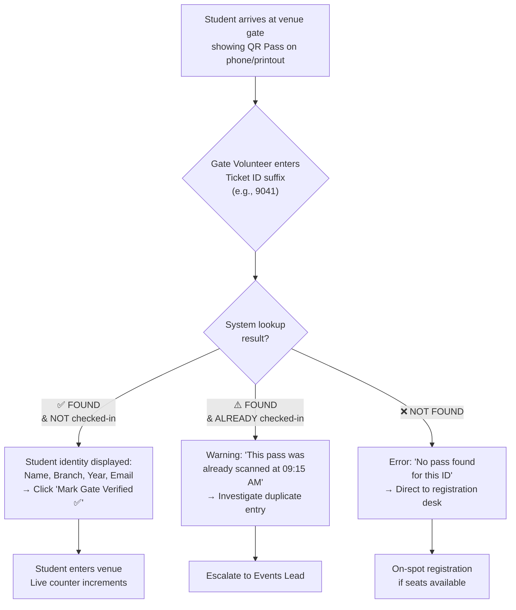

# 🎪 Event Operations (ChefOps) Ground Runbook
### Standard Operating Procedures for On-Ground Event Execution
**Station:** 💻 Development × 🎪 Events & Operations  
**Chapter:** CodeChef ABESEC (2026–27)

| Meta | Detail |
|:---|:---|
| **Document Type** | Operational Runbook / SOP |
| **Audience** | Events & Operations Coordinators, Gate Volunteers, Faculty Advisors |
| **Covers** | Pre-event capacity planning → Event-day gate ops → Post-event faculty reporting |

---

## Why This Runbook Exists

In most college technical chapters, **Development** and **Events & Operations** are disconnected:

```
┌─ Traditional Workflow ──────────────────────────────────────────────┐
│                                                                     │
│  Developer builds     Events team manages     No bridge between     │
│  a static website  →  registrations in    →   digital platform &    │
│  with Google Form     Google Sheets            ground execution      │
│                                                                     │
│  Result: Duplicate entries, no gate verification, manual headcounts │
│          Faculty OD sheets filled by hand at 10 PM                  │
└─────────────────────────────────────────────────────────────────────┘
```

**ChefOps v2.6 closes this gap:**

```
┌─ ChefOps Integrated Workflow ───────────────────────────────────────┐
│                                                                     │
│  Student registers    Unique QR Chef Pass     Admin scans pass at   │
│  on the platform  →   generated instantly →   venue gate → live     │
│  (duplicate guard)    (printable/mobile)      check-in dashboard    │
│                                                                     │
│  Result: Zero duplicates, instant gate verification, live capacity  │
│          monitoring, 1-click CSV export for faculty OD sheets       │
└─────────────────────────────────────────────────────────────────────┘
```

---

## SOP-1: Pre-Event Capacity & Overflow Management

### Timeline: `T-7 days` to `T-1 day`

### Scenario Matrix

| Occupancy Level | Dashboard Indicator | Coordinator Action |
|:---|:---|:---|
| **< 65%** | 🟢 Emerald bar — "Open Seats" | Standard promotion. Share event links on WhatsApp/Instagram. |
| **65% – 85%** | 🟠 Amber bar — "Filling Fast" | Push urgency broadcast: *"Only 25 seats left for Cook-Off 7.0!"* via Admin Broadcast Ticker. |
| **> 85%** | 🔴 Rose bar (pulsing) — "Critical Capacity" | **Decision Point:** Either (a) Edit event capacity if extra lab approved by HOD, or (b) Push waitlist broadcast and close active registration. |
| **100%** | 🔴 "HOUSEFULL" badge | Registration auto-blocks. Form shows: *"This event is at full capacity."* |

### Step-by-Step Procedure

```
1. Open Admin Console → Ops Overview tab
2. Review the Seat Heatmap Table for all upcoming events
3. Identify events in Amber (65-85%) or Rose (>85%) zones
4. For critical events:
   a. Contact faculty coordinator for overflow room approval
   b. If approved → Edit Event → Increase capacity
   c. If denied  → Push broadcast: "Waitlist open, DM @events_lead on WhatsApp"
5. Screenshot the Ops Overview heatmap for pre-event documentation
```

---

## SOP-2: Event-Day Gate QR Check-In Operations

### Timeline: `T-0` — Event morning (`08:00 AM` onwards)

### Gate Desk Setup Requirements

| Item | Purpose |
|:---|:---|
| Laptop/tablet with browser open to Admin Console → QR Scanner tab | Primary scanning station |
| Backup phone with event website open | Fallback if laptop fails |
| Printed attendee list (CSV export from previous night) | Offline backup |
| "Scan Your Chef Pass Here" signage | Student guidance |

### Check-In Flow (Per Student)



### Scanner UI Response Patterns

| Result | Visual Feedback | Sound/Animation |
|:---|:---|:---|
| **Valid + First Scan** | Emerald border glow, `ShieldCheck` icon, student details card | Smooth scale-up animation |
| **Valid + Already Scanned** | Amber border glow, warning banner with original scan timestamp | Gentle pulse animation |
| **Not Found** | Red border, shake animation, "Ticket not found" message | Quick horizontal shake |

### Handling Edge Cases

| Edge Case | Resolution Protocol |
|:---|:---|
| Student forgot their pass | Search by email in Admin → Student Roster → manually verify + check in |
| Student registered for wrong event | Events Lead can verify in Student Roster → redirect to correct venue |
| Network/browser crash mid-event | All data persists in LocalStorage. Refresh browser → state intact. |
| Gate volunteer accidentally checks in wrong student | Click the student in roster → toggle check-in status back to "Pending" |

---

## SOP-3: Run-of-Show Stage Management

### Timeline: `T-0` — Throughout the event

### Purpose
Every ABESEC event has a structured timeline (the **Run-of-Show**) stored inside each event's data. This ensures that transitions between stages happen on schedule and the responsible station owner is clearly identified.

### Run-of-Show for `Cook-Off 7.0` (Flagship Reference)

| Time | Stage | Owner | Ops Notes |
|:---|:---|:---|:---|
| `09:00 AM` | Gate Check-In & QR Pass Verification | Events & Ops Desk | Gate scanner active. Ops Lead at entrance. |
| `10:30 AM` | Problem Statements Unlocked & Kitchen Bell 🔔 | Core Dev & CP Leads | Confirm projector + WiFi working in Seminar Hall. |
| `04:00 PM` | Mentorship Checkpoint 1 + Samosa & Chai Drop ☕ | Mentors & Ops Team | Coordinate with canteen for 120 chai + samosa delivery. |
| `12:00 AM` | Midnight Lightning Bug-Smash Mini Contest | CP Station | Ensure Bhabha Lab power backup is ON. Distribute RedBull. |
| `08:00 AM` | Final Git Freeze, Jury Pitching & Winner Coronation 🏆 | All Stations | Set up judging table. Ensure GitHub repos are public. |

### Coordinator Checklist

```
□ Open Admin Console → Click any event → verify Run-of-Show agenda is accurate
□ Print physical copy of Run-of-Show for each stage owner
□ Set phone alarms for each stage transition (10 min prior warning)
□ After each stage transition, update broadcast ticker:
    e.g., "🔔 Problem Statements are LIVE! Head to your assigned lab."
```

---

## SOP-4: Post-Event Attendance & Faculty OD Sheet Export

### Timeline: `T+0` to `T+1 day`

### Context
ABES Engineering College faculty coordinators require a verified attendance sheet (by Branch and Year) to grant:
- **Attendance credits** for missed regular lectures
- **OD (On-Duty) certificates** for inter-department events

### Export Procedure

```
1. Open Admin Console → Student Roster tab
2. Apply filters:
   ├── Event:  Select specific event (e.g., "Cook-Off 7.0")
   ├── Branch: Select branch if faculty needs branch-specific sheet
   │           (e.g., "CSE-AIML" for AIML department HOD)
   └── Status: "Checked-In" only (to exclude no-shows)
3. Click "📥 Export CSV Sheet"
4. File downloads as: registrations_export.csv
5. Open in Excel/Google Sheets
6. Add header row: "CodeChef ABESEC — [Event Name] — Attendance Sheet"
7. Add signature row at bottom for faculty sign-off
8. Print and submit to respective department HOD
```

### CSV Output Sample

```
Ticket ID,Student Name,College Email,Branch,Year,WhatsApp,Event Title,Station Interest,Check-In Status,Registered At
CC-ABES-9041,Rohit Sharma,rohit.25b010@abes.ac.in,CSE,2nd Year (2025-29),9876543210,Cook-Off 7.0,Development + Events,Checked-In,2026-09-28 01:40 PM
CC-ABES-8812,Aayush Pratap Singh,aayush.25b014@abes.ac.in,CSE-AIML,2nd Year (2025-29),9811223344,Cook-Off 7.0,Competitive Programming,Checked-In,2026-09-28 11:15 AM
```

### Faculty Submission Checklist

```
□ CSV exported with correct event + branch filter
□ Verified row count matches physical gate check-in count (±2 tolerance)
□ If mismatch > 2 → cross-reference with Admin Scanner logs
□ Print 2 copies: 1 for department HOD, 1 for chapter records
□ Submit within 24 hours of event completion
```

---

## Appendix: Emergency Operations Playbook

| Emergency | Immediate Action | Admin Console Action |
|:---|:---|:---|
| **WiFi down at venue** | Switch gate scanner to offline printed list (exported CSV) | Pre-export CSV before event starts as backup |
| **Projector failure** | Share problem statements via WhatsApp/CodeChef platform | Push broadcast: "Check WhatsApp group for problem links" |
| **Unexpected crowd overflow** | Contact security + redirect to overflow room | Edit event capacity. Push broadcast with new room info. |
| **Medical emergency** | Call campus security (ext. 1111). Clear area. | Push broadcast: "Medical team en route. Please stay seated." |
| **Power outage (midnight)** | Confirm UPS/generator status with facility team | All data safe in LocalStorage (client-side). No data loss. |

---

<p align="center"><code>ChefOps v2.6</code> · Operations Runbook · CodeChef ABESEC 2026–27</p>
